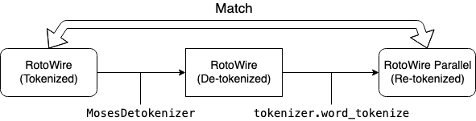

## Constructing the missing tokenizer

Since automatic evaluations such as BLEU relies on n-gram counts, having a consistent tokenization
between training and testing resources is crucial.

The original [RotoWire dataset](https://github.com/harvardnlp/boxscore-data) provides tokenized
texts, where the tokenization is done by using [NLTK](http://www.nltk.org/) and separation of
"hyphnated phrases" according the authors. However, the raw un-tokenized texts are not publicly
available and re-creating exactly the same tokenizer as the one used for the original dataset is
challenging.

Therefore in our task, we construct a tokenizer based on the same punkt tokenizer from NLTK with
additional regular expression-based processing, which is able to produce consistent and similar
tokenization as the original dataset.

The tokenizer is made in a way that the both ends in the figure below will be as close as possible.

  

Specifically, we follow the two steps below to simulate the original tokenization.

1. Take the original (English) RotoWire dataset and detokenize the texts to create a pseudo-raw texts.
2. Implement a tokenizing function which can replicate the original tokenized texts as much as possible.
